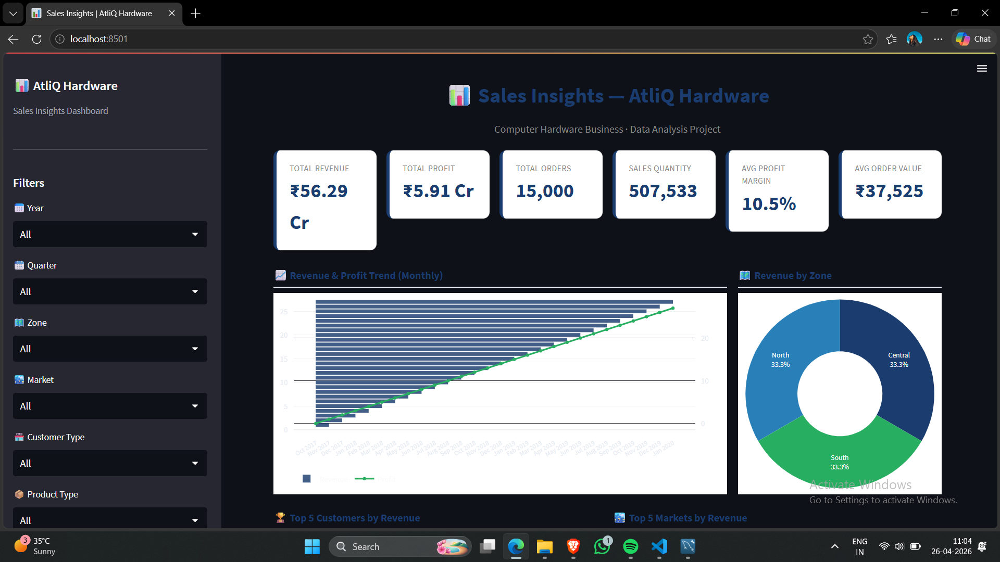
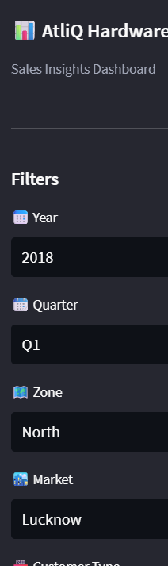
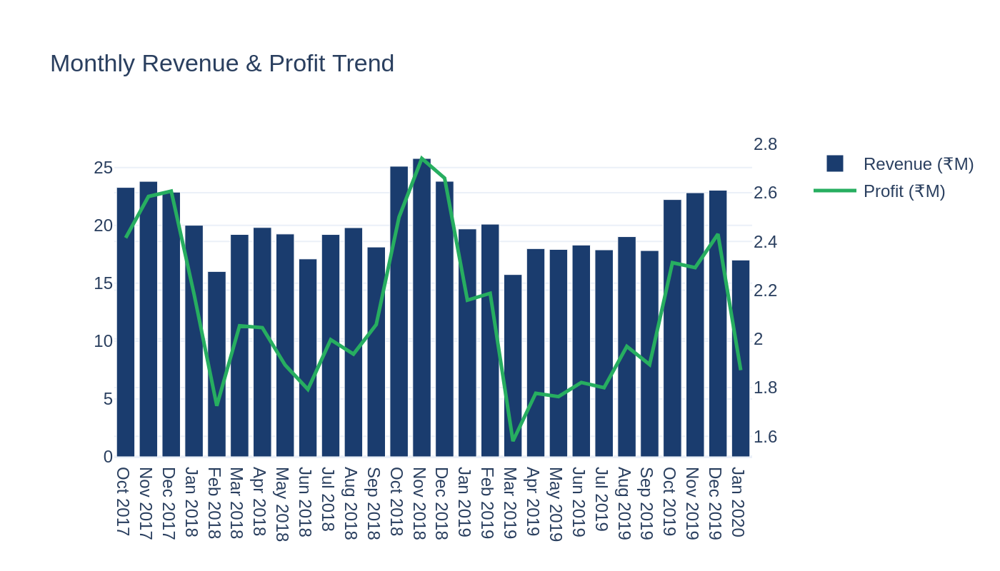
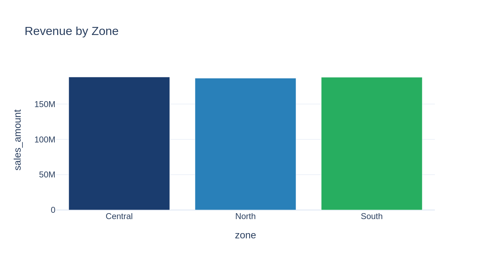
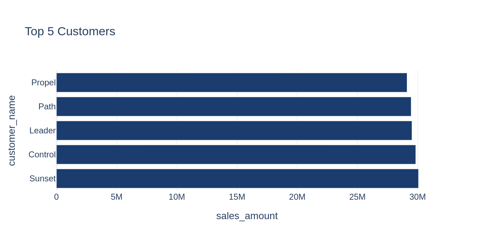
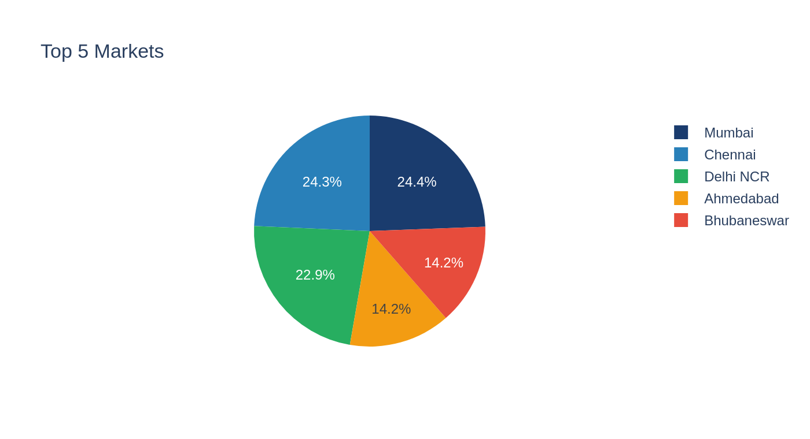
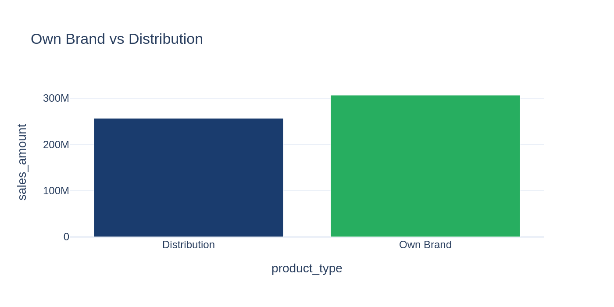
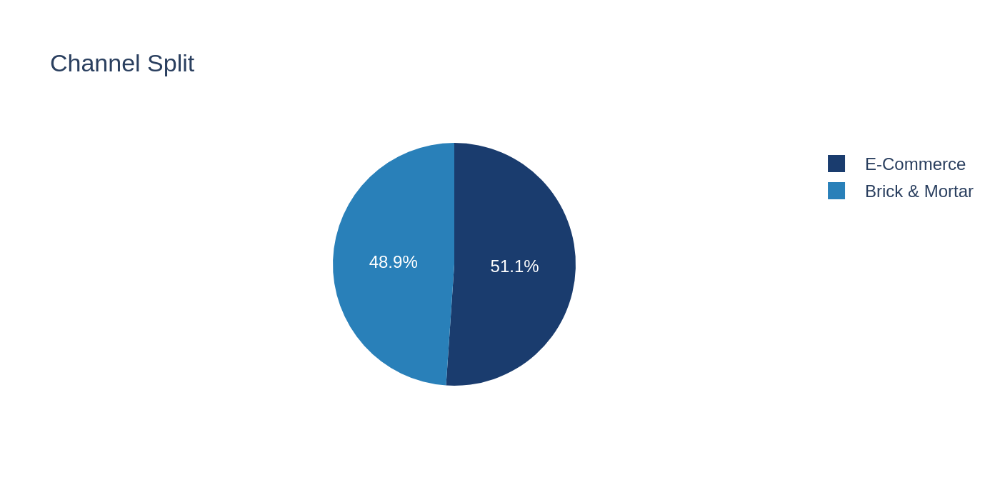

# 📊 Sales Insights Dashboard — AtliQ Hardware


---

## 📌 Problem Statement

AtliQ Hardware is a computer hardware supplier facing challenges in a dynamically changing market. The Sales Director wants real-time sales insights to make data-driven decisions. This dashboard provides a comprehensive view of revenue, profit margins, regional performance, and customer analytics.

> Inspired by the [Codebasics Sales Insights Data Analysis Project](https://codebasics.io/resources/sales-insights-data-analysis-project)

---

## 📸 Screenshots

### Dashboard Overview


### Sidebar Filters


### Revenue & Profit Monthly Trend


### Revenue by Zone


### Top 5 Customers by Revenue


### Top 5 Markets


### Own Brand vs Distribution


### Channel Split — Brick & Mortar vs E-Commerce


---

## ✨ Dashboard Features

- 📈 **Revenue & Profit Trend** — Monthly dual-axis bar + line chart
- 🗺️ **Zone-wise Analysis** — North, South, Central revenue breakdown
- 🏆 **Top 5 Customers** — By revenue with customer type split
- 🏙️ **Top 5 Markets** — Best performing cities
- 💰 **Profit Margin Analysis** — By market and product type
- 📦 **Own Brand vs Distribution** — Product type comparison
- 🏪 **Brick & Mortar vs E-Commerce** — Channel analysis
- 📆 **Quarterly Trend** — Revenue and profit over quarters
- 📋 **Interactive Data Tables** — Searchable, downloadable
- 🔽 **6 Filter Controls** — Year, Quarter, Zone, Market, Customer Type, Product Type

---

## 🗄️ Database Schema

```
sales_insights_db
├── transactions   (150,000+ rows)
├── customers      (20 customers)
├── products       (18 products)
├── markets        (17 markets)
└── date           (date dimension)
```

---

## 🛠️ Tech Stack

| Tool | Purpose |
|---|---|
| **Python** | Core language |
| **MySQL** | Database (AtliQ schema) |
| **Pandas** | Data cleaning & analysis |
| **Plotly** | Interactive visualizations |
| **Streamlit** | Dashboard web app |
| **SQL** | Data extraction & analysis queries |

---

## 📁 Project Structure

```
Sales-Insights-Dashboard/
├── data/
│   └── sales_data.csv
├── screenshots/
│  └── (all 8 PNGs)
├── analysis_queries.sql
├── app.py
├── db_dump.sql
├── generate_data.py
├── requirements.txt
├── .gitignore
├── LICENSE
└── README.md
```

---

## 🚀 How to Run

### Option A — Quick Start (no MySQL needed)

```bash
# 1. Clone
git clone https://github.com/Rosesharma13/Sales-Insights-Dashboard.git
cd Sales-Insights-Dashboard

# 2. Install dependencies
pip install -r requirements.txt

# 3. Generate data (already included in data/)
python generate_data.py

# 4. Run dashboard
streamlit run app.py
```

Open **http://localhost:8501** 🎉

### Option B — Full MySQL Setup

```bash
# Import database
mysql -u root -p < db_dump.sql

# Run SQL analysis
mysql -u root -p sales_insights_db < analysis_queries.sql

# Run dashboard
streamlit run app.py
```

---

## 📊 Key SQL Queries

```sql
-- Total Revenue
SELECT ROUND(SUM(sales_amount)/10000000, 2) AS total_revenue_cr
FROM transactions;

-- Revenue by Market
SELECT m.markets_name, ROUND(SUM(t.sales_amount)/1000000, 2) AS revenue_mn
FROM transactions t
JOIN markets m ON t.market_code = m.markets_code
GROUP BY m.markets_name ORDER BY revenue_mn DESC;

-- Profit Margin by Zone
SELECT m.zone, ROUND(AVG(t.profit_margin_percentage), 2) AS avg_margin
FROM transactions t
JOIN markets m ON t.market_code = m.markets_code
GROUP BY m.zone;
```

---

## 📈 Key Business Insights

- **₹56.29 Cr** total revenue across 2017–2020
- **₹5.91 Cr** total profit margin
- **Delhi NCR & Mumbai** are top performing markets
- **Own Brand** products deliver higher profit margins than Distribution
- **Brick & Mortar** dominates revenue but **E-Commerce** is growing
- **Q4 (Oct–Dec)** shows consistent seasonal revenue peaks

---

## 🔑 Key Learnings

- **AIMS Grid** — Project planning using Purpose, Stakeholders, End Result, Success Criteria
- **SQL Analysis** — Joins, aggregations, window functions for business insights
- **Data Cleaning** — Removing invalid currencies, negative values, duplicates
- **ETL Pipeline** — Extract from MySQL → Transform with Pandas → Load into dashboard
- **Dashboard Design** — Executive-level dashboards with Streamlit + Plotly

---

## 👩‍💻 Author

**Rose Sharma** | AI/ML Engineer

[](https://www.linkedin.com/in/rose-sharma13)
[](https://github.com/Rosesharma13)
[](mailto:rosesharmaa132003@gmail.com)

---

## 🙏 Credits

Project concept inspired by [Codebasics](https://codebasics.io) Sales Insights Data Analysis Project.

## 📄 License

MIT License
